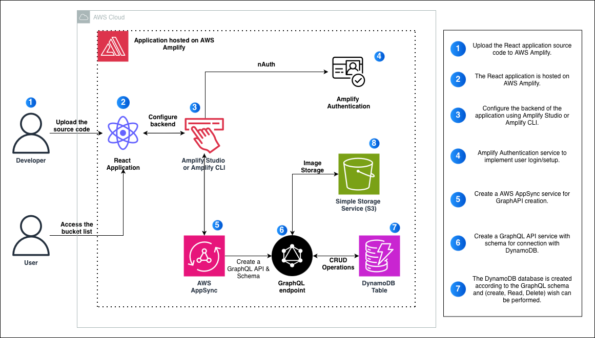

# Bucket-list-tracker-application-on-AWS-Amplify
Serverless **Bucket List Tracker** built and deployed on **AWS Amplify**, demonstrating a full-stack cloud app with authentication, data storage, and scalable hosting. 


## Steps to be perfomed:
1. Develop a bucket list tracker application in React.

2. Initialize a Github respository and cononect it to yoyur local repostiroty. hos the frontend on Amplify Hosting.

3. Use Amplify Studio / Amplify CLI and integrate Amplify Authentication providing user authentication for Login / Singup.

4. Create a AWS AppSync service for the building and managing a GraphQL API, and a GraphQL schema for DynamoDB service integration.

5. Deploy the backend on AWS Amplify to handle data storage and serer-side logic.


## Service Used:
-  **AWS Amplify** - fronetend hosting + backend deployment
- **AWS AppSync** - managed GraphQL API
- **GrapghQL API + Schema** - structured data access layer
- **Amazon DynamoDB** - bucket list items databse
- **Amazon S3** - image storage


## Architectural Diagram


## Step 1: Create the React App (Vite)
1. Create a new react project using Vite:
``` bash
npm create vite@latest bucketlistapp -- --template react
cd bucketlistapp
npm install
npm run dev
```
2. Open the app in your browser:

- In the terminal output, click the **Local** URL (or copy-paste it into your browser)


## Step 1.1: Initialize a GitHub Repository
1. Create a new GitHub respostory:

- Log in to GitHub
- Create a **new public respository** name `bucketlistapp`.

2. Push your local React app to GitHub (run inside the project root `bucketlistapp`):
``` bash
git init
git add .
git commit -m "initial commit"
git remote add origin git@github.com:<your-username>/bucketlistapp.git
git branch -M main
git push -u orign main
```

## Step 1.2:
1. From the project root (`bucketlistapp`), scaffold an Amplifu project:
``` bash
npm create amplify@latest -y
```

2. Commit and push the change:
``` bash
git add .
git commit -m "installing amplify"
git push origin main
```


## Step 1.3: Deploy the App with AWS Amplify Hosting
1. Open the **AWS Amplify Console** in the AWS Management Console.
2. Click **Create new app**.
3. Under **Deploy your app**, choose **GitHub** -> **Next**.
4. Authenticate with GitHub, then select:

- Repository: `bucketlistapp`
- Branch: `main`

5. For **Service role**, choose **Create and use a new service role**. Keep defaults -> **Next**.
6. Review -> click **Save and deploy**.


## Step 2: Step Up Amplify Authentication

- Amplify Auth is configured in: `amplify/auth/resource.ts`
- For this project, **do not modify the deafult settings**.


## Step 2.1: Set Up Amplify Data (Schema)
 Define a data model so each user can **create**, **list**, and **delete** only their own bucket items (owner-based access contorl).

 1. Open:

 - `bucketlistapp/amplify/data/resource.ts`

 2. Replace the contents with:
 ``` ts
 import { type ClientSchema, a, defineData } from '@aws-amplify/backend';

const schema = a.schema({
  BucketItem: a
    .model({
      title: a.string(),
      description: a.string(),
      image: a.string(),
    })
    .authorization((allow) => [allow.owner()]), // owner-only access
});

export type Schema = ClientSchema<typeof schema>;

export const data = defineData({
  schema,
  authorizationModes: {
    defaultAuthorizationMode: 'userPool',
  },
});
```


## Step 2.2: Set Up Amplify Storage (Image Uploads)
1. Create the file:
- `bucketlistapp/amplify/storage/resource.ts`

2. Add this configuration:
``` ts
import { defineStorage } from "@aws-amplify/backend";

export const storage = defineStorage({
  name: "amplifyBucketTrackerImages",
  access: (allow) => ({
    "media/{entity_id}/*": [
      allow.entity("identity").to(["read", "write", "delete"]),
    ],
  }),
});
```


## Step 2.3: Step Up Amplify Storage
1. Create:
- `bucketlistapp/amplify/storage/resource.ts`

2. Paste:
``` ts
import { defineStorage } from "@aws-amplify/backend";

export const storage = defineStorage({
  name: "amplifyBucketTrackerImages",
  access: (allow) => ({
    "media/{entity_id}/*": [
      allow.entity("identity").to(["read", "write", "delete"]),
    ],
  }),
});
```


## Step 2.4: Finalize Backend Setup
1. Open:
- `amplify/backend.ts`

2. Upadte it to:
``` ts
import { defineBackend } from '@aws-amplify/backend';
import { auth } from './auth/resource';
import { data } from './data/resource';
import { storage } from './storage/resource';

defineBackend({
  auth,
  data,
  storage,
});
```


## Step 2.5: Deploy the Backend to an Amplify Sandbox
1. From the project root, start the sandbox:
``` bash
npx ampx sndbox
```

2. After deployment completes:
- You'll see a success message
- Amplify generate `amplify_outputs.json` in your project


### Common AWS Credentials Error
`SSMCredentialsError: UnrecognizedClientException: The security token included in the request is invalid`

To fix this configure AWS credentials:
``` bash
aws configure
```

Get your **Access Key** and **Secret Access Key** from:
    **AWS Console -> IAM -> Users -> Security credentials


## Step 3: Install Amplify Client Libraries
From the project root (`bucketlistapp`), install the Amplify client SDK and UI components:
``` bash
npm install aws-amplify @aws-amplify/ui-react
```

`aws-ampliify` provides the frontendAPIs to connect to Auth/Data/Storage, and `@aws-amplify/ui-react` adds ready-made UI components (especially for authentication).


## Step 3.1: UI Setup and Styling
1. Update the app styling:
- File: `src/index.css`
- Replace with own code.

2. Wire up the UI + Amplify integration:
- File: `src/App.jsx`
- Replace `src/App.jsx` with own code


## Step 3.2: Launch the App Locally
1. From the project root (`bucketlistapp`), start the dev server:
``` bash
npm run dev
```
2. Open the **localhost** URL shown in the terminal.
3. Sign up and verify:

- Go to **Create Account**.
- Enter **email** + **password** and create the account.
- Enter the **verification code** sent to your email to confirm and sign in

4. Use the app:

- Add bucket list items
- View your list
- Delete entires (and optionally upload images, if enabled)


## Step 3.3: Push Change to GitHub (Auto-Deploy via Amplify)
1. Commit and push your updates:
``` bash
git add .
git commit -m "bucket list tracker app"
git push origin main
```

2. Open the **AWS Amplify Console**.
3. Amplify will automatically trigger a new build + deployment after every psuh to `main`.
4. CLick **Vist deployed URL** to view the live app on your `*.amplifyapp.com` domain.


## Step 4: Conclusion
A full-stack **Bucket List Tracker** and deployed it on **AWS Amplify** with:
- **Authentication** (email sign-up + verification)
- **GraphQL + DynamoDB** for per-user data
- **S3 storage** for optional image uploads
- **CI/CD via GitHub** with automatic deployments.

### What's Next:
- Upgrade the UI/UX (filters, edit flow, item status, better layout)
- Register and connect a custom domain

### Clean-up (Delete Resources)
1. Open **AWS Console** -> **Amplify** -> select `bucketlistapp`
2. Go to **App settings** -> **General settings**
3. Click **Delete app**
